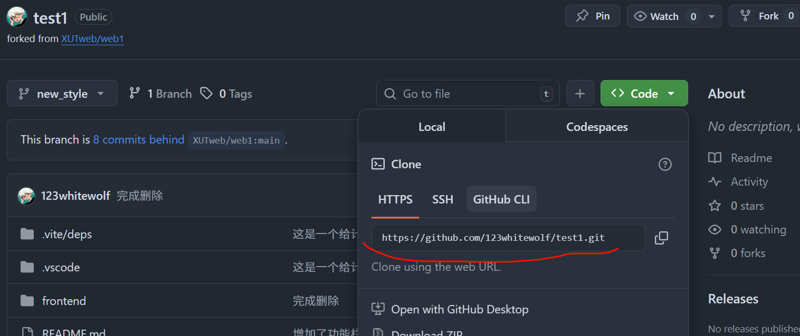

## 展示


## 环境准备

- 安装 [Node.js](https://nodejs.org/en)
- 安装 [pnpm](https://pnpm.io/installation)


## 操作步骤

- 到达前端文件夹

```sh
cd frontend
```

- 安装依赖

```sh
pnpm install
```

- 启动 Dev Server

```sh
pnpm run dev
```

- 本项目现阶段使用 json-server 模拟 API,如果要登录的话运行运行如下代码

```sh
pnpm install -g json-server
json-server --watch db.json --port 3001
```

- 在浏览器访问 http://localhost:3000

## 项目介绍

- **React 18+** 作为核心 UI 框架
- **TypeScript** 提供类型安全
- **Vite** 作为构建工具
- **Tailwind CSS** 作为样式解决方案
- **React Router** 处理路由导航
- **Framer Motion** 提供动画效果
- **Recharts** 用于数据可视化
- **Context API** 进行状态管理
-

```
src/
├── components/         # 可复用组件
│   ├── Empty.tsx      # 空状态组件
│   └── Icon.tsx       # 图标组件
├── contexts/          # React Context
│   └── authContext.ts # 认证上下文
├── hooks/             # 自定义Hooks
│   └── useTheme.ts    # 主题切换Hook
├── lib/               # 工具函数
│   └── utils.ts       # 通用工具函数
├── pages/             # 页面组件
│   ├── Home.tsx       # 首页
│   ├── LoginPage.tsx  # 登录页
│   ├── ProblemSelectionPage.tsx # 题目选择页
│   ├── ProblemSolvingPage.tsx   # 题目解答页
│   └── ProfilePage.tsx         # 个人资料页
├── App.tsx            # 主应用组件
└── main.tsx           # 应用入口点
```

## 必要 vscode 插件

为了增加项目代码的可读性,建议安装 vscode 的插件  
1.**Btter Comments**(用于丰富注释形式):
并在 setting.json 中添加以下配置:

```json
"better-comments.tags": [
    {
      "tag": "!",
      "color": "rgba(201, 169, 25, 1)",
      "strikethrough": false,
      "underline": false,
      "backgroundColor": "transparent",
      "bold": true,
      "italic": false
    },
    {
      "tag": ">",
      "color": "#3498DB",
      "strikethrough": false,
      "underline": true,
      "backgroundColor": "transparent",
      "bold": false,
      "italic": false
    },
    {
      "tag": "/",
      "color": "#474747",
      "strikethrough": true,
      "underline": false,
      "backgroundColor": "transparent",
      "bold": false,
      "italic": false
    },

    {
      "tag": "*",
      "color": "#98C379",
      "strikethrough": false,
      "underline": false,
      "backgroundColor": "transparent",
      "bold": false,
      "italic": false
    },
    {
      "tag": "-",
      "color": "rgba(21, 215, 170, 0.7)",
      "strikethrough": false, // 是否有删除线
      "underline": false, // 是否有下划线
      "backgroundColor": "transparent",
      "bold": true, // 是都加粗
      "italic": false // 是都斜体
    },
    {
      "tag": "#",
      "color": "rgba(165, 84, 40, 1)",
      "strikethrough": false, // 是否有删除线
      "underline": false, // 是否有下划线
      "backgroundColor": "transparent",
      "bold": true, // 是都加粗
      "italic": false // 是都斜体
    }

```

2.**Color Highlight**(用于高亮注释颜色)

## 项目解释:

这个项目是提供计算机类大学生刷题的网站项目,我们在网页上提供了一些题目,用户可以登录后进行刷题,并且可以查看自己的做题记录,以及一些统计信息。并提供了 Ai 生成题目自动检查答案的功能。
---

## 工作流

### 1.下载git 


[流程](https://blog.csdn.net/mukes/article/details/115693833)

### 2.fork项目
1.

> 这里点击进行fork
2.

> 将项目fork到自己的仓库

### 3.下载项目到本地文件夹

1.
> 点击克隆或者下载


### 4.将修改后的代码提交到自己账号上的仓库里面
1. 在vscode 里面"ctrl+j"打开终端打开git bash

2. 将本地仓库与远端仓库链接


- 使用下面的命令将本地仓库与远端仓库链接 

```sh
git remote add origin https://github.com/your_username/your_repo.git
```

3. 提交修改

```
git add .
git commit -m "your commit message"
git push origin main
```

